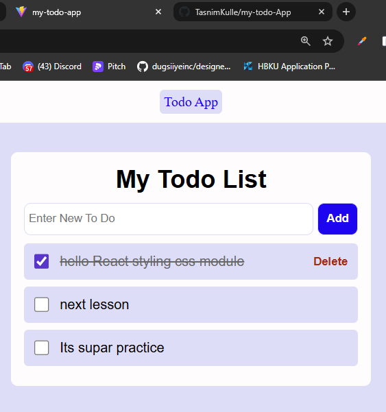

# Todo App - React Project
- A simple and Moderen Todo Application built with React.js. 
- manage your daily tasks efficiently  
## 🚀Features
- ➕ New Todo
- ✅ Completion State(checkbox)
- 🗑️  Delete when Completed
- 🎨 Css Modules-Scoped styles

### 🌐 Live Demo
[**View Live Application**](https://my-todo-app-inky-zeta.vercel.app/)

### Project View 
- 
  

  
- ✍️ _By [Tasnim Kulle](https://github.com/TasnimKulle)_